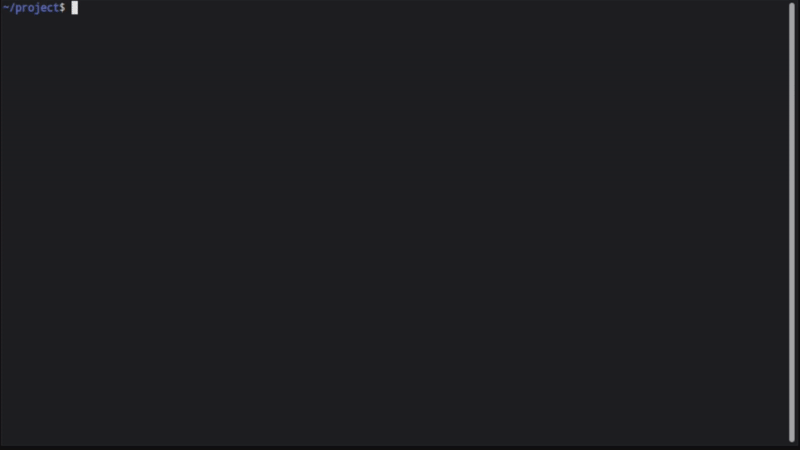
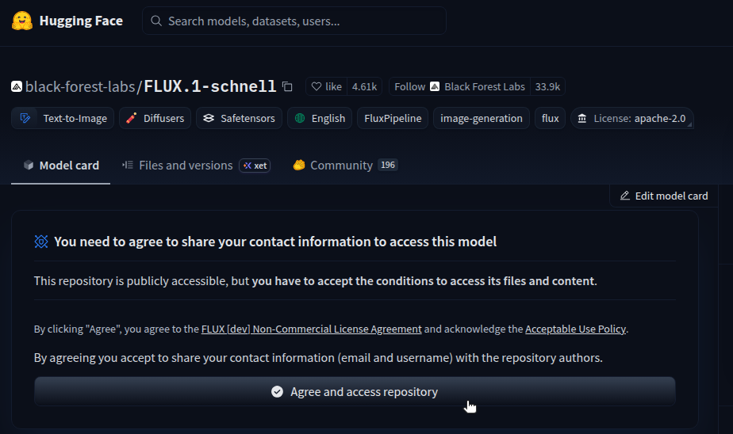
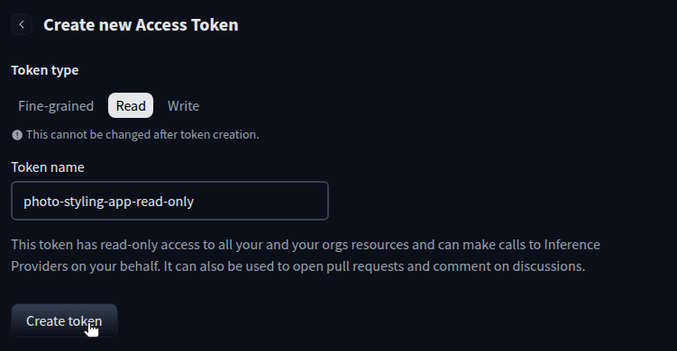
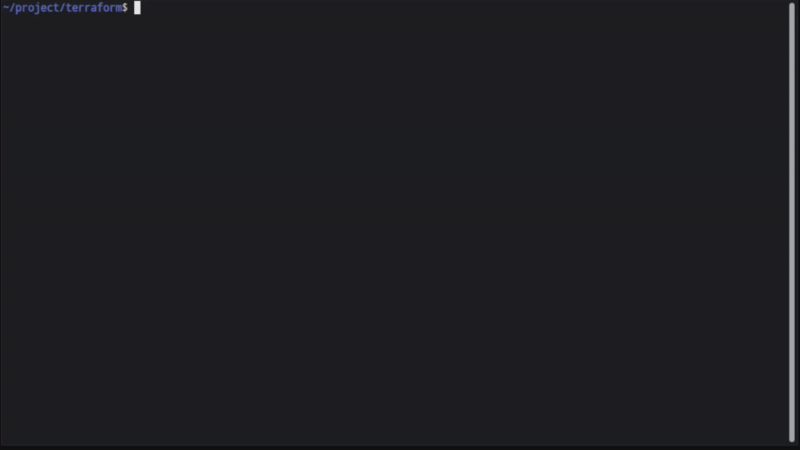
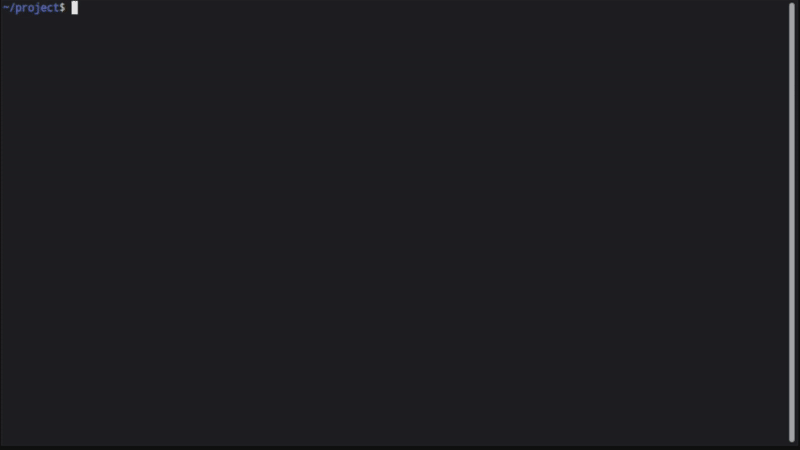
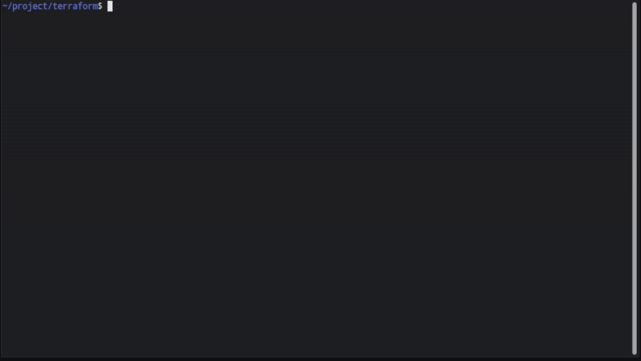
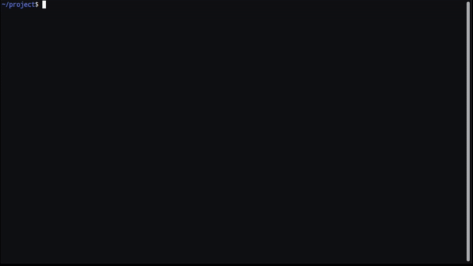

# Photo Styling App

A web-based application that transforms user selfies into stylized, high-quality images based on specific themes (Superhero, Cyberpunk, Fantasy, or Professional). The app uses Vision-Language Models (VLM) and Image Generation models running on GPU nodes in a Kubernetes cluster.

## Architecture

```
+--------------------------------------------------------------------+
|                       User's Device (Browser)                      |
|     +--------------------------------------------------------+     |
|     |     Frontend (HTML/JS) - Camera capture & display      |     |
|     +--------------------------+-----------------------------+     |
+--------------------------------+-----------------------------------+
                                 | HTTP
                                 v
+--------------------------------------------------------------------+
|                 LKE Cluster (photo-styling namespace)              |
|                                                                    |
|  +---------------------------------------------------------------+ |
|  |  app-service (LoadBalancer -> NodeBalancer)                   | |
|  |  +---------------------------------------------------------+  | |
|  |  |  FastAPI App Deployment (CPU node pool)                 |  | |
|  |  |  - Receives selfie upload                               |  | |
|  |  |  - Calls VLM service (HTTP)                             |  | |
|  |  |  - Generates prompt (features + theme)                  |  | |
|  |  |  - Calls Image Generator service (HTTP)                 |  | |
|  |  |  - Returns stylized image                               |  | |
|  |  +----------+----------------------+-----------------------+  | |
|  +--------------+----------------------+-------------------------+ |
|                 |                      |                           |
|        +--------v--------+   +--------v--------------+             |
|        |  vlm-service    |   |  imagegen-service     |             |
|        |  (ClusterIP)    |   |  (ClusterIP)          |             |
|        |  +-----------+  |   |  +------------------+ |             |
|        |  | VLM Pod   |  |   |  | ImageGen Pod     | |             |
|        |  | Qwen3-VL  |  |   |  | FLUX.1-schnell   | |             |
|        |  | 1x GPU    |  |   |  | 2x GPU           | |             |
|        |  +-----------+  |   |  +------------------+ |             |
|        +-----------------+   +-----------------------+             |
+--------------------------------------------------------------------+
```

## Features

- **Camera Capture**: Live camera preview and capture on mobile/desktop (requires https)
- **Image Upload**: Upload existing photos
- **Theme Selection**: Choose from 4 themes (Superhero, Cyberpunk, Fantasy, Professional)
- **Privacy-First**: All processing in-memory, no disk storage

## Model Selection

**VLM Models:**
- [Qwen/Qwen3-VL-8B-Instruct-FP8](https://huggingface.co/Qwen/Qwen3-VL-8B-Instruct-FP8) (FP8 quantized, requires GPU with compute capability 8.0+)

**Image Generator Models:**
- [black-forest-labs/FLUX.1-schnell](https://huggingface.co/black-forest-labs/FLUX.1-schnell)

## Project Structure

```
photo-styling-app/
├── terraform/                       # Infrastructure as Code
│   ├── main.tf                      #   LKE cluster with GPU and CPU node pools
│   ├── variables.tf                 #   Variable definitions
│   ├── outputs.tf                   #   Kubeconfig and cluster outputs
│   └── terraform.tfvars.example     #   Example variables
├── k8s/                             # Kubernetes manifests (numbered for apply order)
│   ├── 00-namespace.yaml            #   photo-styling namespace
│   ├── 01-nvidia-device-plugin.yaml #   NVIDIA GPU device plugin DaemonSet
│   ├── 02-secrets.yaml              #   HuggingFace token secret
│   ├── 03-vlm-deployment.yaml       #   VLM model deployment (1x GPU)
│   ├── 04-vlm-service.yaml          #   VLM ClusterIP service
│   ├── 05-imagegen-deployment.yaml  #   Image generator deployment (2x GPU)
│   ├── 06-imagegen-service.yaml     #   ImageGen ClusterIP service
│   ├── 07-app-deployment.yaml       #   FastAPI app deployment (CPU)
│   ├── 08-app-service.yaml          #   App LoadBalancer service
│   └── deploy.sh                    #   Deploy script (envsubst + kubectl apply)
├── models/                          # Model predictor containers
│   ├── vlm/                         #   VLM service
│   │   ├── predictor.py             #     KServe predictor for VLM
│   │   ├── Dockerfile               #     Container image
│   │   └── requirements.txt         #     Python dependencies
│   └── imagegen/                    #   Image Generator service
│       ├── predictor.py             #     KServe predictor for image generation
│       ├── Dockerfile               #     Container image
│       └── requirements.txt         #     Python dependencies
├── app/                             # FastAPI orchestration app
│   ├── main.py                      #   FastAPI application
│   ├── models.py                    #   Pydantic models
│   ├── prompt_engine.py             #   Prompt generation logic
│   └── client.py                    #   HTTP clients for model services
├── static/                          # Frontend files
│   ├── index.html                   #   Main web interface
│   ├── styles.css                   #   Styling
│   └── app.js                       #   Camera handling and API calls
├── tests/                           # Test scripts
│   └── test_pipeline.py             #   End-to-end pipeline test
├── Dockerfile                       # Container image for web app
└── requirements.txt                 # Python dependencies for web app
```

## Prerequisites

- [Terraform](https://www.terraform.io/) >= 1.0
- [Docker](https://www.docker.com/) (for building container images)
- [kubectl](https://kubernetes.io/docs/tasks/tools/)
- Create an [Akamai Cloud account here](http://login.linode.com/signup?promo=akm-dev-git-300-31126-M055) with API token (we have a $300 credit just for you) 
- [Docker Hub](https://hub.docker.com/) account (for pushing images)
- [HuggingFace](https://huggingface.co/) account and API token (for gated models)

## Deployment

### Step 1: Build and push container images

#### Authenticate

```bash
export DOCKERHUB_USER=your-dockerhub-username
docker login
```



([Go to high-resolution screencast](./screencasts/01-docker-login.mp4))

#### Build, push, and remove each image to minimize local storage

```bash
docker build -t $DOCKERHUB_USER/photo-styling-app:latest .
docker push $DOCKERHUB_USER/photo-styling-app:latest
docker rmi $DOCKERHUB_USER/photo-styling-app:latest
```


([Go to high-resolution screencast](./screencasts/02-docker-build-1.mp4))

```bash
docker build -t $DOCKERHUB_USER/vlm-predictor:latest models/vlm/
docker push $DOCKERHUB_USER/vlm-predictor:latest
docker rmi $DOCKERHUB_USER/vlm-predictor:latest
```


([Go to high-resolution screencast](./screencasts/03-docker-build-2.mp4))

```bash
docker build -t $DOCKERHUB_USER/imagegen-predictor:latest models/imagegen/
docker push $DOCKERHUB_USER/imagegen-predictor:latest
docker rmi $DOCKERHUB_USER/imagegen-predictor:latest
```


([Go to high-resolution screencast](./screencasts/04-docker-build-3.mp4))

**Note:** Your Docker Hub repositories must be **public** so that Kubernetes can pull the images without authentication. Private repositories would require configuring an `imagePullSecret` in each Deployment. For this proof of concept, using a public repository is acceptable, since the images contain only open-source dependencies and model-loading code, with no secrets or proprietary data. For production-grade deployments, use private repositories and proper secrets.

### Step 2: Configure HuggingFace access

The VLM model ([Qwen/Qwen3-VL-8B-Instruct-FP8](https://huggingface.co/Qwen/Qwen3-VL-8B-Instruct-FP8)) is publicly available and requires no special access.

The image generation model ([black-forest-labs/FLUX.1-schnell](https://huggingface.co/black-forest-labs/FLUX.1-schnell)) is a gated model. To use it:

1. Go to the [FLUX.1-schnell model page](https://huggingface.co/black-forest-labs/FLUX.1-schnell) and click **Agree and access repository**. Access is typically granted immediately.

   

2. Create a [HuggingFace User Access Token](https://huggingface.co/docs/hub/en/security-tokens) with **Read** access. You'll use this token in a later deploy step.

   

Save the token as an environment variable (`HF_TOKEN`).



([Go to high-resolution screencast](./screencasts/05-export-token.mp4))

### Step 3: Create LKE cluster

#### Add Akamai Cloud personal acccess token to Terraform variables

[Create an Akamai Cloud personal access token](https://techdocs.akamai.com/cloud-computing/docs/manage-personal-access-tokens) (Linode API token) to Terraform to use in provisioning LKE resources. The token should have:

* **Read Only** permissions for **Events**
* **Read/Write** permissions for **Kubernetes**

```bash
cd terraform
cp terraform.tfvars.example terraform.tfvars
```

Edit `terraform.tfvars` with your Linode API token:

```hcl
linode_token = "your-linode-api-token-here"
```



([Go to high-resolution screencast](./screencasts/06-tfvars.mp4))

Deploy the cluster:

```bash
terraform init
terraform plan
terraform apply
```


([Go to high-resolution screencast](./screencasts/07-terraform-apply.mp4))

This creates an LKE cluster with 3 node pools:
- **VLM GPU pool**: 1x `g2-gpu-rtx4000a1-m` (1x RTX 4000 Ada, 20GB VRAM, 32GB RAM)
- **ImageGen GPU pool**: 1x `g2-gpu-rtx4000a2-m` (2x RTX 4000 Ada, 40GB VRAM, 65GB RAM)
- **App CPU pool**: 2x `g6-standard-2` (2 CPU, 4GB RAM each)

### Step 4: Configure kubectl and verify cluster readiness

```bash
terraform output -raw kubeconfig | base64 -d > kubeconfig.yaml
export KUBECONFIG=$(pwd)/kubeconfig.yaml
kubectl get nodes
```



([Go to high-resolution screencast](./screencasts/08-kubectl.mp4))

### Step 5: Deploy to Kubernetes

The `k8s/deploy.sh` script uses `envsubst` to substitute `${DOCKERHUB_USER}` and `${HF_TOKEN}` into the manifests at apply time — no secrets are stored in the YAML files. The manifests are numbered to ensure they are applied in the correct order. The NVIDIA device plugin DaemonSet enables Kubernetes to discover and schedule GPU resources on LKE GPU nodes. Without it, GPU pods will stay `Pending`.

The deploy script requires the following environment variables to be set:

* `DOCKERHUB_USER`: Already set in Step 1
* `KUBECONFIG`: Already set in Step 4
* `HF_TOKEN`: The HuggingFace token created in Step 2


```bash
./k8s/deploy.sh
```


([Go to high-resolution screencast](./screencasts/09-deploy.mp4))

#### Monitor the rollout

```bash
# Watch all pods come up
kubectl get pods -n photo-styling -w

# Check VLM pod (will take several minutes to download the model on first run)
kubectl logs -f -n photo-styling -l app=vlm

# Check ImageGen pod
kubectl logs -f -n photo-styling -l app=imagegen
```



([Go to high-resolution screencast](./screencasts/10-monitor-rollout.mp4))

### Step 6: Access the application

Get the external IP assigned by the LoadBalancer (Linode NodeBalancer):

```bash
kubectl get svc app-service -n photo-styling
```

Wait for the `EXTERNAL-IP` to change from `<pending>` to an IP address, then:

- **Health check**: `curl http://<external-ip>/health | jq`

> [!TIP]
> The [jq](https://jqlang.org/download/) tool supports all platforms, and provides prettier structured JSON outputs.


([Go to high-resolution screencast](./screencasts/11-service-ip-and-health-check.mp4))

## Testing

The VLM and ImageGen services are ClusterIP only, so they're not reachable from outside the cluster. To test them, create a temporary curl pod inside the cluster, read its output, then delete the curl pod.

### Test VLM service (from within the cluster)

```bash
kubectl run curl-test --image=curlimages/curl -n photo-styling --restart=Never \
  -- curl -s http://vlm-service/v1/models

kubectl logs curl-test -n photo-styling

kubectl delete pod curl-test -n photo-styling
```


([Go to high-resolution screencast](./screencasts/12-test-vlm.mp4))

### Test image generator service (from within the cluster)

```bash
kubectl run curl-test --image=curlimages/curl -n photo-styling --restart=Never \
  -- curl -s http://imagegen-service/v1/models

kubectl logs curl-test -n photo-styling

kubectl delete pod curl-test -n photo-styling
```


([Go to high-resolution screencast](./screencasts/13-test-imagegen.mp4))

### Test in browser


([Go to high-resolution screencast](./screencasts/14-test-in-browser-1.mp4))


([Go to high-resolution screencast](./screencasts/14-test-in-browser-2.mp4))

## Troubleshooting

### Pods stuck in pending

GPU pods may stay `Pending` if no GPU node is available:

```bash
kubectl describe pod -n photo-styling -l app=vlm
kubectl describe pod -n photo-styling -l app=imagegen
```

Check that GPU nodes are ready and have available `nvidia.com/gpu` resources:

```bash
kubectl get nodes
kubectl describe node <gpu-node-name> | grep -A 5 "Allocatable"
```

### Model download taking too long

The first time a model pod starts, it downloads the model from HuggingFace. This can take 10-30 minutes. Monitor progress:

```bash
kubectl logs -f -n photo-styling -l app=vlm
kubectl logs -f -n photo-styling -l app=imagegen
```

### App returns "degraded" health status

The app's `/health` endpoint reports `degraded` if it can't reach the model services. Check that the model pods are running and the services resolve:

```bash
# Check all pods are Running
kubectl get pods -n photo-styling

# Test service DNS from the app pod
kubectl exec -n photo-styling -l app=photo-styling-app -- \
  curl -s http://vlm-service/v1/models
```

### LoadBalancer stuck on "pending"

If `app-service` never gets an external IP:

```bash
kubectl describe svc app-service -n photo-styling
```

Check that LKE NodeBalancer provisioning is working. This typically resolves within a few minutes.

### Restarting a deployment

```bash
kubectl rollout restart deployment/vlm -n photo-styling
kubectl rollout restart deployment/imagegen -n photo-styling
kubectl rollout restart deployment/app -n photo-styling
```

## Testing the camera feature (HTTPS)

The camera capture feature uses the browser's `getUserMedia` API, which requires HTTPS. The app works over plain HTTP for image upload, but to test the live camera you need a secure connection.

In production, you would point a domain at the LoadBalancer IP and use cert-manager with Let's Encrypt to provision a TLS certificate. For a quick proof of concept, use [ngrok](https://ngrok.com/) to tunnel HTTPS to your LoadBalancer:

1. [Install ngrok](https://ngrok.com/download) and authenticate:

   ```bash
   ngrok config add-authtoken <your-ngrok-token>
   ```

2. Get your app's external IP:

   ```bash
   kubectl get svc app-service -n photo-styling
   ```

3. Start the tunnel:

   ```bash
   ngrok http http://<external-ip>
   ```

4. Open the `https://` forwarding URL from the ngrok output in your browser. Camera access will work.

## Cleanup

To tear down everything:

```bash
# Delete Kubernetes resources
kubectl delete -f k8s/

# Destroy the LKE cluster
cd terraform
terraform destroy
```


([Go to high-resolution screencast](./screencasts/15-teardown.mp4))
